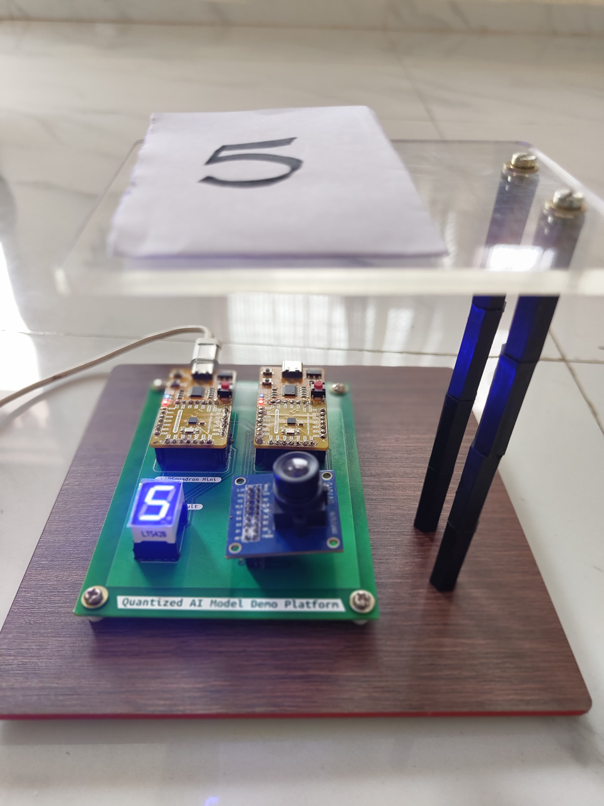
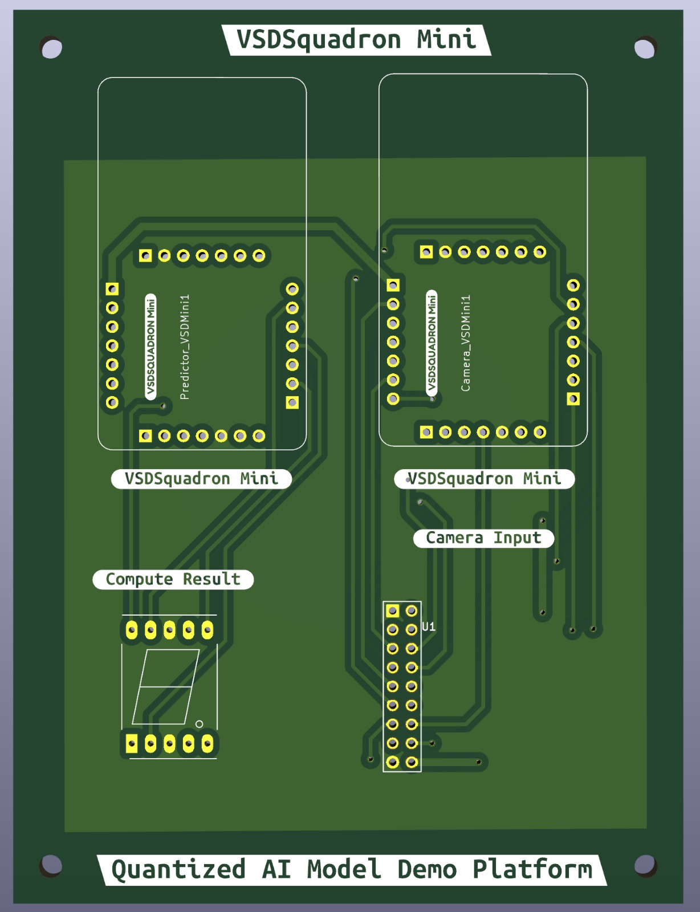
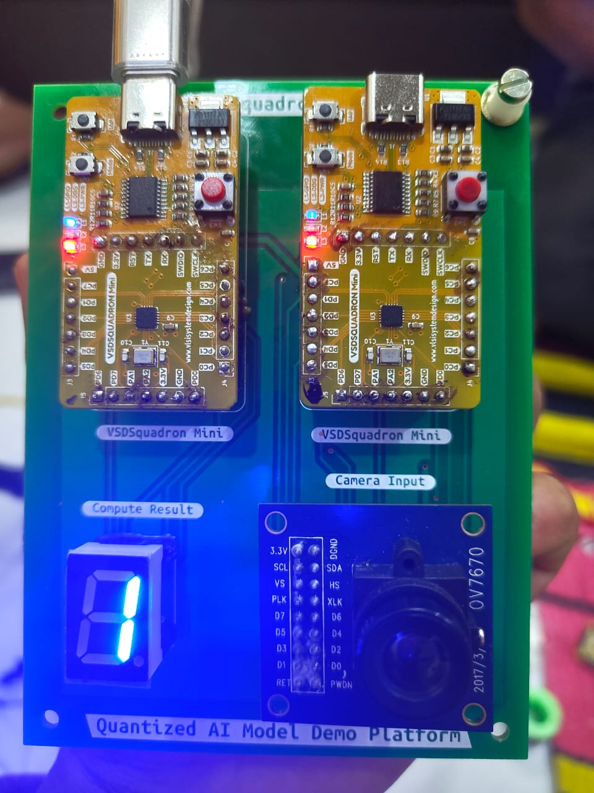
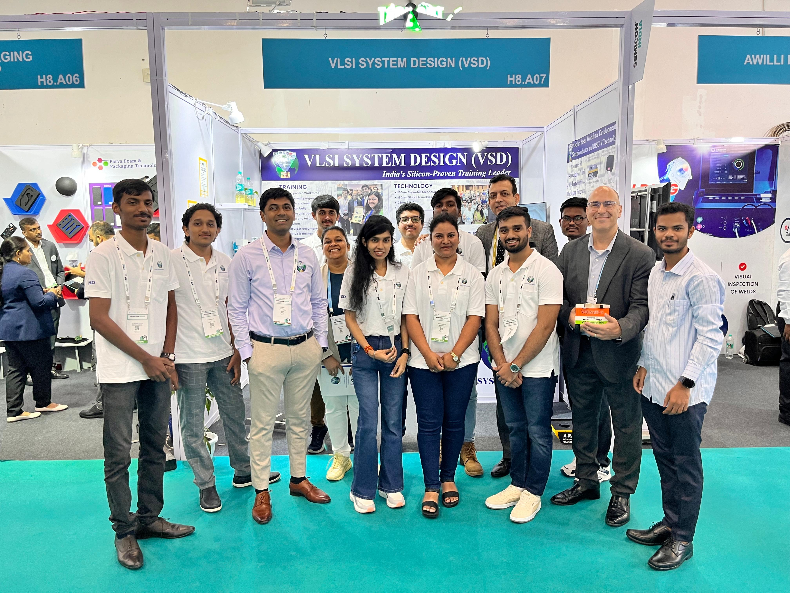
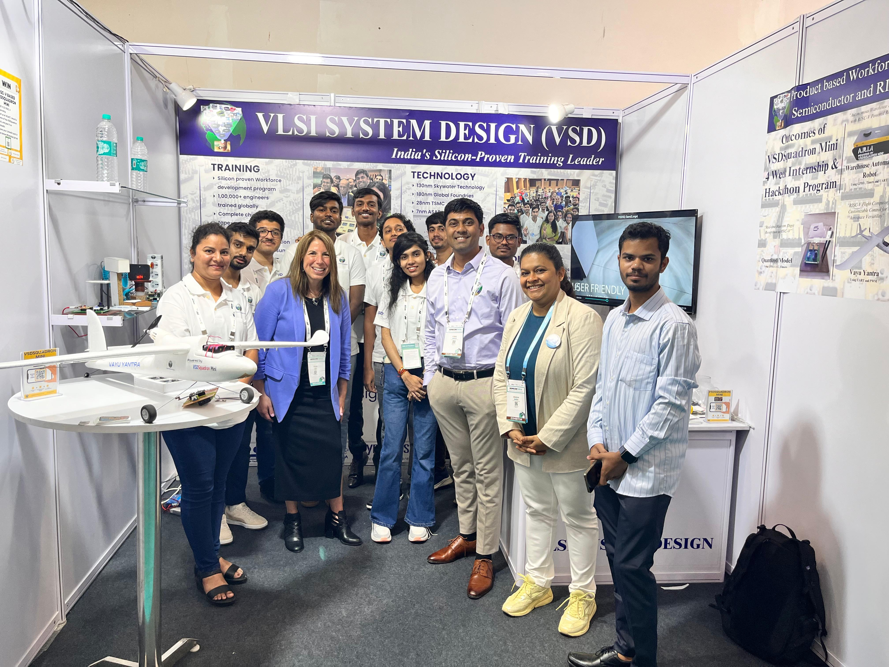
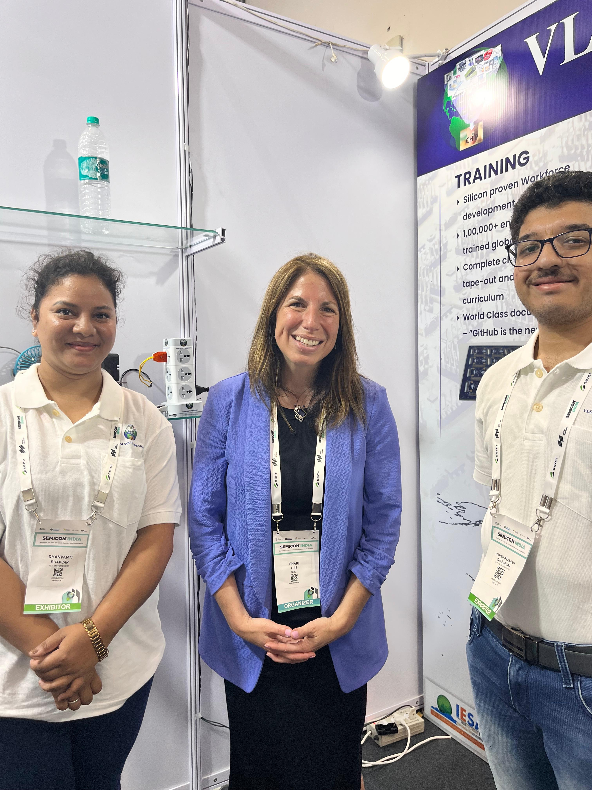
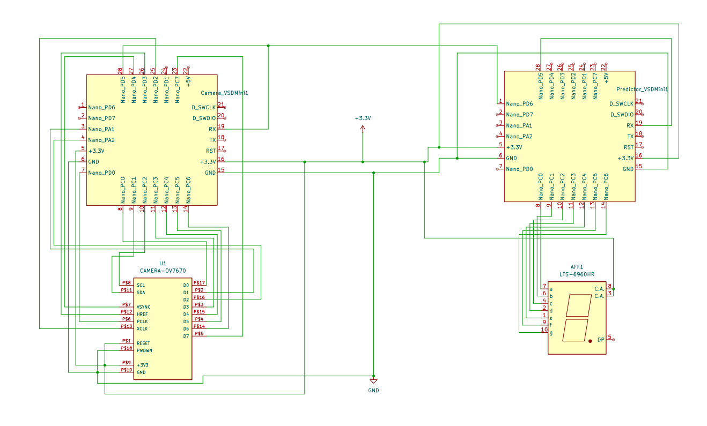

# Quantized AI Model
- Exhibited at :- Semicon 2024 with VSD (VLSI System Design) team
- Presended By :- VLSI System Design
- Duration :- 11 Sep to 13 Sep
- Based on :- Real Time Implementation of Low-Bit Quntized Neural network on Risc-V microcontroller

## Main Features 
- Demonstrates Neural network on VSD Squadron Mini Risc-V development board
- Interfaced  camera with CH32V003F4U6 based microcontroller
- Demonstrates on edge AI capabilities of Risc-V microcontroller
- Complete demonstration implemented on VSD Squadron Mini based on Risc-V microcobtroller

## Demo Video 
https://github.com/user-attachments/assets/e731484d-ab7b-4347-bf47-5b0f53fb8fbb

## Demo kit images


## PCB Design
Please find the complete pcb design structure in [PCB_DESIGN](./PCB_DESIGN/)
Use kicad to open the schematic as well as PCB design. Here is a image of top silk layer

Here is a image of printed PCB with components attached

 

## Semicon Gallary






## Social Media link
[Media linkedIn Post](https://www.linkedin.com/posts/dhanvanti-bhavsar-387620160_the-india-expo-centre-mart-buzzed-with-activity-7241767522583138305-5wRa?utm_source=share&utm_medium=member_desktop)

[linkedIn Post](https://www.linkedin.com/posts/dhanvanti-bhavsar-387620160_semicon2024-vlsi-riscv-activity-7241765933315174400-G3Z_?utm_source=share&utm_medium=member_desktop)


**Please Check underlying Readme.md files for further details of every task**

## Flow of the QUantized AI Model
1. [Training](./Training/)
2. [Camera Interfacing](./VSD_Camera_Interfacing/)
3. [Prediction](./VSD_Prediction/)

## Circuit diagram
- 

## Project structure
```
SEMICON2024_Quantized_AI_Model

Directory Structure
Below is the complete directory structure of the project:

SEMICON2024_Quantized_AI_Model/
├── images
├── project_root
├── Training
│   ├── a.out
│   ├── BitNetMCU.py
│   ├── BitNetMCUdemo.c
│   ├── BitNetMCU_inference.c
│   ├── BitNetMCU_inference.h
│   ├── BitNetMCU_MNIST_dll.c
│   ├── BitNetMCU_MNIST_test.c
│   ├── BitNetMCU_MNIST_test_data.h
│   ├── BitNetMCU_model.h
│   ├── BitNetMCU_model28.h
│   ├── BitNetMCU_model28x28.h
│   ├── BitNetMCU_model28x28.h.gch
│   ├── BitNetMCU_model_321616.h
│   ├── BitNetMCU_model_643216.h
│   ├── Bitnet_inf.dll
│   ├── exportquant.py
│   ├── Makefile
│   ├── models.py
│   ├── readme.md
│   ├── requirements.txt
│   ├── testoutput.o
│   ├── test_inference.py
│   ├── training.py
│   └── trainingparameters.yaml
│   ├── data
│   │   └── MNIST
│   │       └── raw
│   ├── images
│   ├── modeldata
├── VSD_Camera_Interfacing
│   ├── .gitignore
│   ├── platformio.ini
│   ├── Readme.md
│   ├── .vscode
│   │   └── extensions.json
│   ├── boards
│   │   └── VSDSquadron.json
│   ├── include
│   │   └── README
│   ├── lib
│   │   ├── README
│   │   └── LiveOV7670Library
│   │       ├── CameraOV7670.cpp
│   │       ├── CameraOV7670.h
│   │       ├── CameraOV7670RegisterDefinitions.h
│   │       ├── CameraOV7670Registers.cpp
│   │       ├── CameraOV7670Registers.h
│   │       ├── CameraOV7670RegistersDefault.cpp
│   │       ├── CameraOV7670RegistersQQVGA.cpp
│   │       ├── CameraOV7670RegistersYUV422.cpp
│   │       └── readme.txt
│   ├── src
│   │   ├── main.cpp
│   │   ├── SendUartImageBitNet.cpp
│   │   └── SendUartImageBitNet.h
│   └── test
│       └── README
└── VSD_Prediction
    ├── .gitignore
    ├── platformio.ini
    ├── readme.md
    ├── .vscode
    │   └── extensions.json
    ├── data
    │   ├── BitNetMCU_inference.c
    │   ├── BitNetMCU_inference.h
    │   ├── BitNetMCU_model.h
    │   ├── BitNetMCU_model28.h
    │   ├── BitNetMCU_model28x28.h
    │   ├── BitNetMCU_model_321616.h
    │   └── BitNetMCU_model_643216.h
    ├── include
    │   └── README
    ├── lib
    │   └── README
    ├── src
    │   └── main.c
    └── test
        └── README


```
## Description of Directories

### Root Directory

- *images/*  
  Contains images and videos used for documentation purposes, such as implementation videos, circuit diagrams, dataset visuals, and training snapshots.

- *project_root/*  
  (Currently empty or reserved for future use. Provide details if applicable.)

### Training

- *Training/*  
  Holds all files related to training the neural network model.

  - *data/*
  
    - *MNIST/raw/*  
      Contains raw MNIST dataset files, including images and labels for both training and testing.

  - *modeldata/*  
    Stores trained model files with various configurations and hyperparameters.

  - *runs/*  
    Contains logs and event files for different training runs, useful for tracking experiments and performance.

#### Key Files:
- training.py: Main script for training the model.
- BitNetMCU.py, BitNetMCUdemo.c, etc.: Scripts and source files related to the BitNetMCU implementation.
- Makefile: Build instructions.
- requirements.txt: Python dependencies.
- exportquant.py: Script for exporting quantized models.
- trainingparameters.yaml: Configuration file for training parameters.

### VSD_Camera_Interfacing

- *VSD_Camera_Interfacing/*  
  Contains code and configurations for interfacing the camera with the VSD platform.

  - *.vscode/*  
    VSCode-specific settings and extensions.

  - *boards/*  
    Board configuration files, e.g., VSDSquadron.json.

  - *include/*  
    Header files and additional includes.

  - *lib/*  
    Libraries used in the project, such as the LiveOV7670Library for camera operations.

  - *src/*  
    Source code files handling the main functionality, including image transmission via UART.

  - *test/*  
    Test scripts and documentation for verifying camera interfacing.

#### Key Files:
- platformio.ini: PlatformIO configuration.
- main.cpp: Main application code.
- SendUartImageBitNet.cpp & .h: Code for sending images over UART.

### VSD_Prediction

- *VSD_Prediction/*  
  Contains code and configurations for the prediction module within the VSD platform.

  - *.vscode/*  
    VSCode-specific settings and extensions.

  - *data/*  
    Data files related to the prediction module, including inference and model headers.

  - *include/*  
    Header files and additional includes.

  - *lib/*  
    Libraries used in the prediction module.

  - *src/*  
    Source code files handling the prediction functionality.

  - *test/*  
    Test scripts and documentation for verifying prediction accuracy and performance.

#### Key Files:
- platformio.ini: PlatformIO configuration.
- main.c: Main application code.


