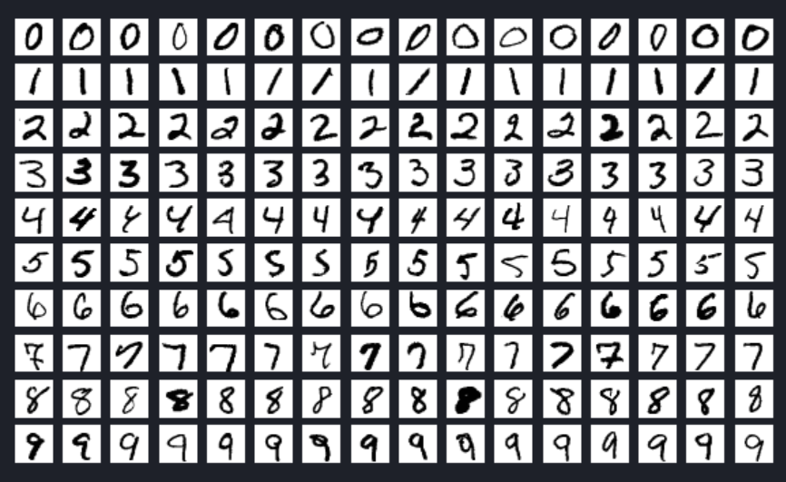
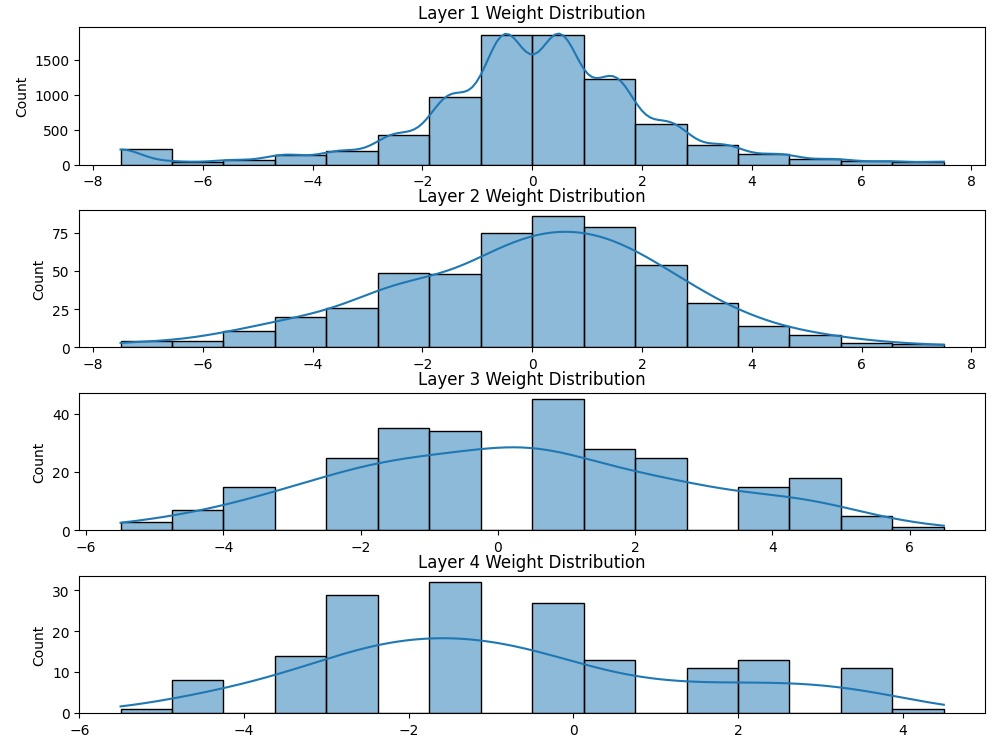
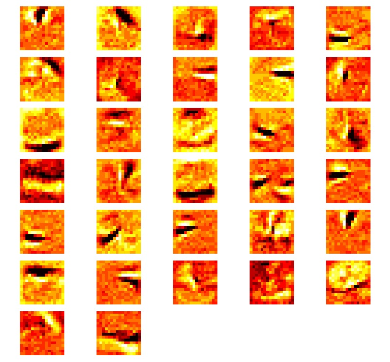
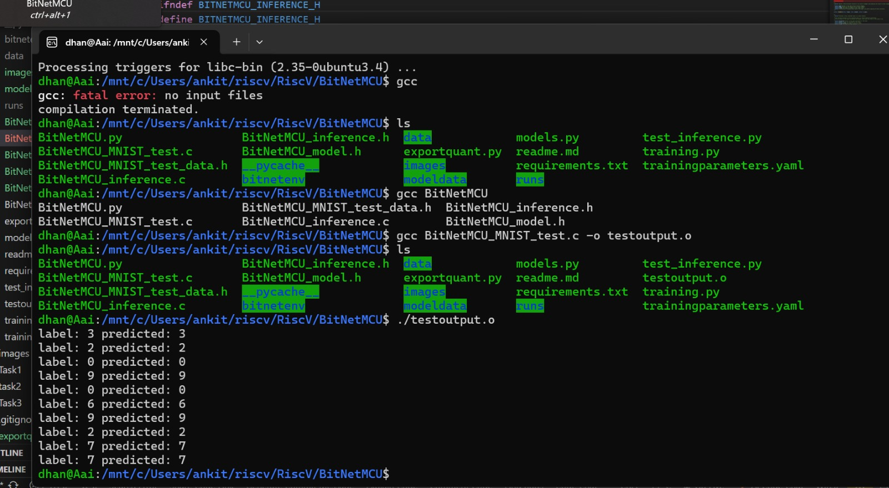

# Training of Quantized AI Model 


## Overview
This is a training implementation of a low-bit quntized neural network on Risc-V microcontroller.
The project is based on the Risc-V microcontroller and MNIST dataset.

### Risc-V
- Board- VSD Squadron Mini
- Processor used- CH32V003F4U6 chip with 32-bit RISC-V core based on RV32EC instruction set
- dataset used- MNIST 
- Algorithm used- Low-bit quntized neural network

#### Low-bit quntized neural network

Neural network quantization is a powerful technique for deploying deep learning models on resource-constrained devices.\
By reducing the memory footprint and computational requirements of models, quantization enables efficient inference and improved privacy.

- Why Quantization?

Quntization is a easy way to compress the model. It can easily applied on existing model without loss of accuracy. 

Types of quantization-
1. Weight Quantization\
The weights of the neural network are reduced to fewer bits precision, typically 8-bits or 16-bits. 
2. Activation Quantization\
The activations of the neural network are also represented using fewer bits, following a similar approach to weight quantization. 
3. Post Training Quantization\
In post training qunatization the weights and activations are quantized to lower precision bits without need of retraining the model. 
4. Quantization Aware Training\
The quantized model is trained to minimize the accuracy loss due to quantization. This involves adjusting the learning rate, batch size, and other hyperparameters to optimize the performance of the quantized model.

#### MNIST dataset
The MNIST dataset is a collection of images of handwritten digits that is commonly used for training machine learning models.\

Key Features-

- The dataset consists of 60,000 training images and 10,000 testing images.\
- Each image is a 28x28 grayscale image.\
- The images are normalized to fit into a 28x28 pixel bounding box and anti-aliased, introducing grayscale levels.
- MNIST is widely used for training and testing in the field of machine learning, especially for image classification tasks.

#### Dataset Structure
The MNIST dataset is split into two subsets:

- Training Set: This subset contains 60,000 images of handwritten digits used for training machine learning models.
- Testing Set: This subset consists of 10,000 images used for testing and benchmarking the trained models.

#### Sample Image of the MNIST dataset


The example showcases the variety and complexity of the handwritten digits in the MNIST dataset, highlighting the importance of a diverse dataset for training robust image classification models.


## Flow of the training
#### BitNetMCU Implementation
- Configuration
- Model Training
- Exporting the quantized model
- Testing the C-model
- Deploying the model on the VSD Squadron Mini
- Testing demo accuracy on VSD Squadron Mini

#### BitNetMCU real time Implementation
- Connecting the camera module to the VSD Squadron Mini
- Capturing images using the camera module
- Preprocessing the images
- Inferring detected digits using the model on the VSD Squadron Mini
- Displaying the output on the 7 segment display

## Circuit Connection for BitNetMCU
No hardware connections are required for BitNetMCU only we have to connect VSD squadron with computer using USB cable.
### Circuit Connection for BitNetMCU real time
The following connections are required for BitNetMCU real time implementation:


## Training the model
The model is trained using the MNIST dataset. The training process involves the following steps:
### Step 1: Install all required Libraries
```
pip install -r requirements.txt
```
### Step 2: Setup Configuration
Edit [trainingparameter.yaml](./trainingparameters.yaml) file and update configuration settings as per following.

#### Quantization Settings

- **QuantType:** `4bitsym`
  - Specifies the quantization method to be used. '4bitsym' stands for symmetric 4-bit quantization, which reduces the precision of weights to 4 bits symmetrically around zero.

- **BPW:** `4`
  - Stands for Bits Per Weight, indicating that each weight in the model will be represented using 4 bits.

- **NormType:** `RMS`
  - Specifies the normalization technique. 'RMS' (Root Mean Square) normalization is used to standardize the range of independent variables or features of data. Other options include 'Lin' for linear normalization and 'BatchNorm' for batch normalization.

- **WScale:** `PerTensor`
  - Defines the scale application strategy. 'PerTensor' means that scaling is applied to the entire tensor, whereas 'PerOutput' would apply scaling to each output individually.

- **quantscale:** `0.25`
  - This parameter sets the scale of the standard deviation for each tensor relative to the maximum value, effectively controlling the spread of weight values after quantization.

#### Learning Parameters

- **batch_size:** `128`
  - Indicates the number of training examples utilized in one iteration. A batch size of 128 means that 128 samples are processed before the model’s internal parameters are updated.

- **num_epochs:** `60`
  - Specifies the number of complete passes through the training dataset. Training will occur over 60 epochs.

- **scheduler:** `Cosine`
  - The learning rate scheduler type. 'Cosine' annealing gradually reduces the learning rate following a cosine curve. Alternative schedulers include 'StepLR', which reduces the learning rate at regular intervals.

- **learning_rate:** `0.001`
  - The initial learning rate for the optimizer, determining the step size at each iteration while moving toward a minimum of the loss function.

- **lr_decay:** `0.1`
  - Factor by which the learning rate is reduced. This is used with step-based learning rate schedulers like 'StepLR' but is not applicable with the 'Cosine' scheduler.

- **step_size:** `10`
  - Step size for learning rate decay in the 'StepLR' scheduler, indicating the number of epochs between each decay step.

#### Data Augmentation

- **augmentation:** `True`
  - A Boolean flag indicating whether data augmentation is to be applied. If True, data augmentation techniques will be used to artificially expand the dataset.

- **rotation1:** `10`
  - Specifies the degree of rotation for data augmentation. Images will be rotated up to 10 degrees in one direction.

- **rotation2:** `10`
  - Specifies the degree of rotation in the opposite direction, allowing rotations up to 10 degrees.

#### Model Parameters

- **network_width1:** `16`
  - Width of the first layer in the neural network, indicating that the first layer contains 32 units or neurons.

- **network_width2:** `16`
  - Width of the second layer in the neural network, with 16 units or neurons.

#### Name

- **runtag:** `opt_`
  - A string prefix used for naming the run or experiment. This helps in identifying and organizing different experimental runs.

#### Summary

This configuration script sets the parameters for a machine learning experiment involving 4-bit symmetric quantization with RMS normalization and per-tensor weight scaling. The model will be trained using a batch size of 128 over 60 epochs with a cosine annealing learning rate scheduler starting at 0.001. Data augmentation includes rotations up to 10 degrees. The neural network architecture consists of three layers, each with 64 units. The run is tagged with the prefix "opt_" to facilitate easy identification.

### Training Neural Network model
- Execute training of model using training.py file
  1. Install python (We used python version 3.12.3 for this demo)
  2. cd into BitNetMCU folder 
  3. Create virtual envioronment using following command
  ```
  python -m venv bitnetenv
  ```
  4. Activate virtual envioronment using following command
  ```
  ./bitnetenv/Scripts/activate
  ```
  5. Install required dependencies in virtual envioronment using following command
  ```
  pip install -r requirements.txt
  ```
  6. Start traing by executing following command
  ```
  python training.py
  ```


- Once training ends trained model will be saved in modeldata folder

### Exporting Model weights to C file for using with VSD 
- Export weights of model using exportquant.py file\
use following command
```
python exportquant.py
``` 
- This will model weights in **BitNetMCU_model.h** file
- We Tried changing multiple model parameters via **trainingparameters.yaml** file and saved to parameters as files with network sizes added
#### Weight Distribution of generated weights of model

#### Weight Intensity of generated weights of model


### Testing Output prediction of model 
- Here we try to provide multiple 28x28 images as input to the model and test the generated predictions
  1. using gcc compile **BitNetMCU_MNIST_test.c** file
    ```
    gcc BitNetMCU_MNIST_test.c -o testoutput.o
    ```
  2. Execute the compiled file 
    ```
    ./testoutput.o
    ```
  - You should be able to see the labels and predictions generated for the test images
  

### Generating dll file for inference
1. install Make 
2. run make command
```
make
```

## Uploading BitNetMCU to VSDSquadron and realtime implementation
- [All details can be found in VSD Prediction folder](/VSD_Prediction/)